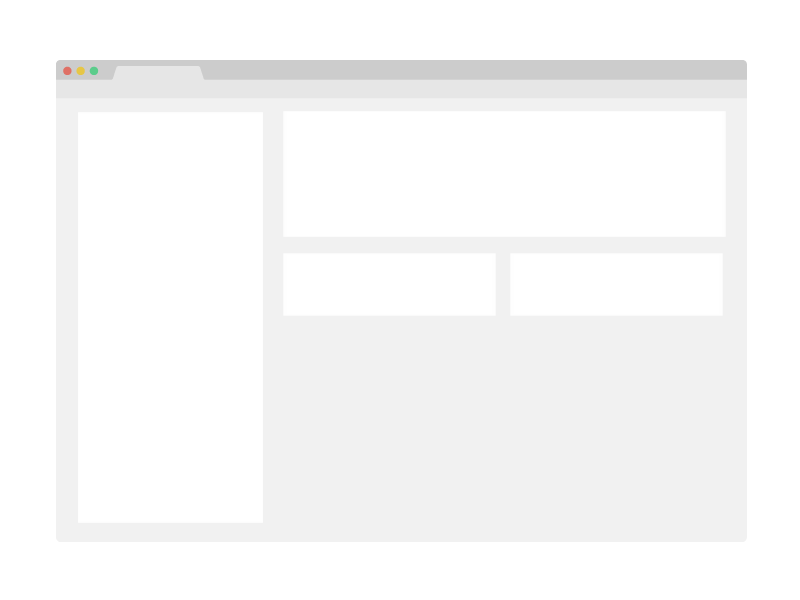

# Awesome Books

> "Awesome books" is a simple website that displays a list of books and allows you to add and remove books from that list.

## Built With

- Html
- JavaScript

## Live Demo

[Live Demo Link](https://keroloussamy.github.io/Awesome-book/)

## Getting Started

To get a local copy up and running follow these simple example steps.

- Click on the top right green "code" button.
- On the dropdown menu, choose "download with zip" button.
- After download, extract the zip file and you have the project running on your machine.

## Authors

👤 **Kerolous Samy**

- GitHub: [@kerolous](https://github.com/keroloussamy)
- Twitter: [@kerolous](https://twitter.com/SamyKerolous)
- LinkedIn: [kerolous](https://www.linkedin.com/in/keroloussamy/)

👤 **William Morales**

- GitHub: [@williamrolando88](https://github.com/williamrolando88)
- Twitter: [@WillyMorales93](https://twitter.com/WillyMorales93)
- LinkedIn: [William Morales](https://www.linkedin.com/in/william-morales-palma/)

👤 **Richard Chambula**

- GitHub: [@rtonata88](https://github.com/rtonata88)
- Twitter: [@rtonata](https://twitter.com/rtonata)
- LinkedIn: [Richard Chambula](https://www.linkedin.com/in/richard-chambula-49198425/)

## 🤝 Contributing

Contributions, issues, and feature requests are welcome!

Feel free to check the [issues page](../../issues/).

## Show your support

Give a ⭐️ if you like this project!

## Acknowledgments

- Hat tip to anyone whose code was used
- Inspiration
- etc

## 📝 License

This project is [MIT](./MIT.md) licensed.
